# Ray Tracing in One Weekend

Peter Shirley의 [Ray Tracing in One Weekend](https://raytracing.github.io/books/RayTracingInOneWeekend.html)를 구현한 프로젝트입니다.


정리 노션 페이지 (PDF 자료 포함): https://app.notion.com/p/Ray-Tracing-In-One-Weekend-3e137781ff7380189b07c3dd11d017e9?source=copy_link


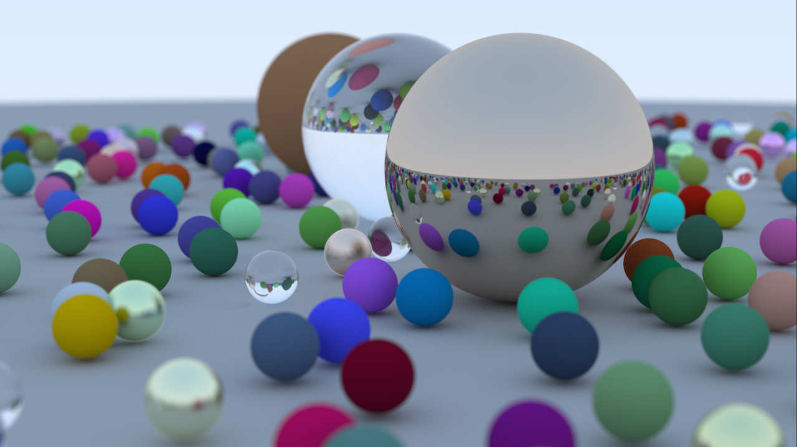

> 1920×1080 · 픽셀당 샘플 500 · 최대 반사 깊이 50

---

## 결과

| | | |
|:-:|:-:|:-:|
| 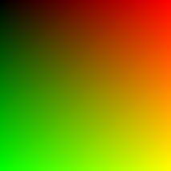 |  | 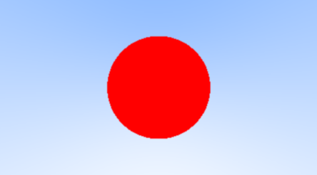 |
| **2장** PPM 이미지 출력 (위치별 색 그라디언트) | **4장** 광선 방향으로 그린 하늘 | **5장** 광선–구 교차 판정 |
| 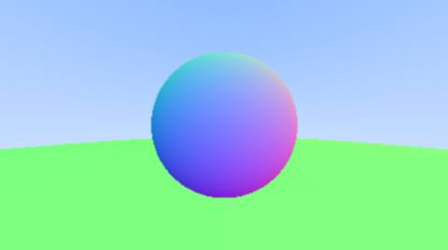 | 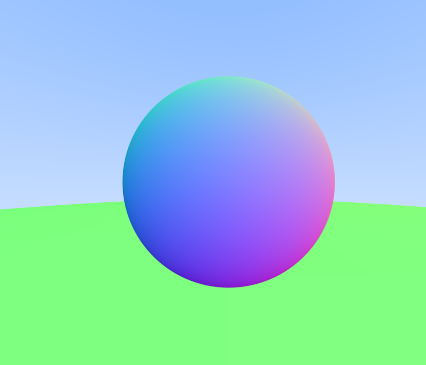 | 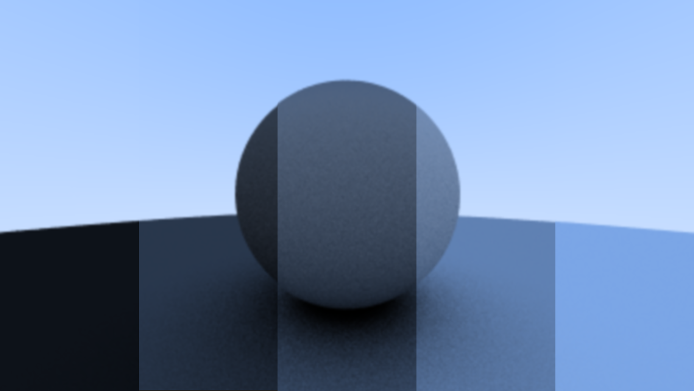 |
| **6장** 법선 시각화, 땅 구 추가 | **8장** 안티에일리어싱 적용 | **9장** 확산 재질, 반사율 10~90% (감마 보정 전) |
| 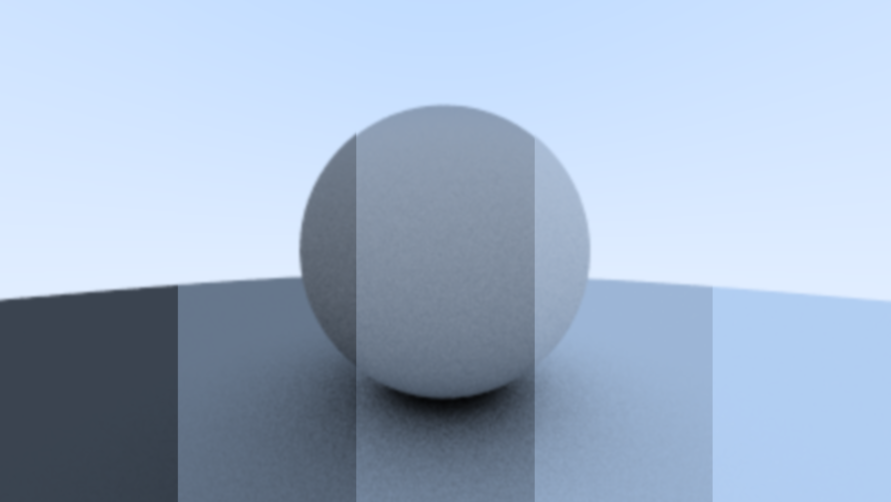 | 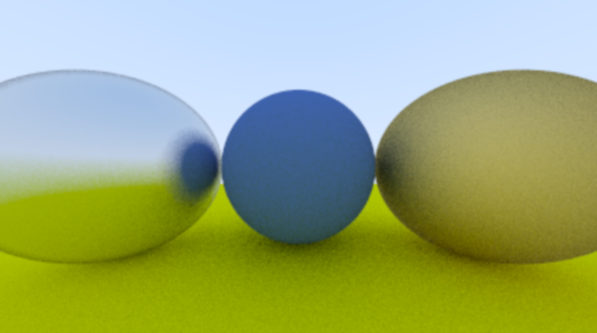 | 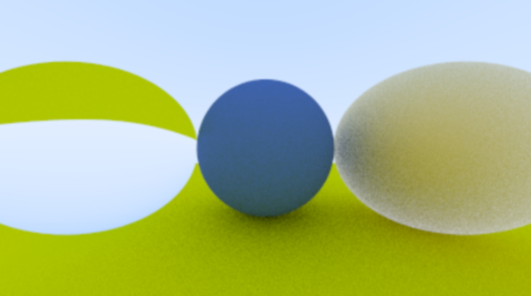 |
| **9장** 감마 보정 후 | **10장** 금속 fuzz 반사 (왼쪽 0.3, 오른쪽 1.0) | **11장** 항상 굴절하는 유리 구 (상이 뒤집힘) |
| 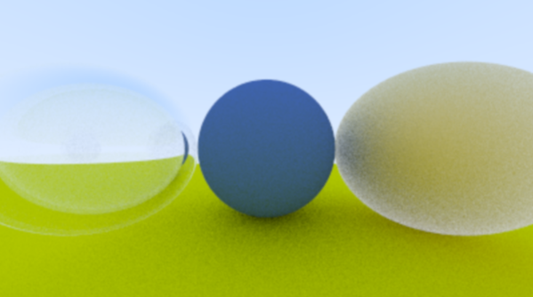 | 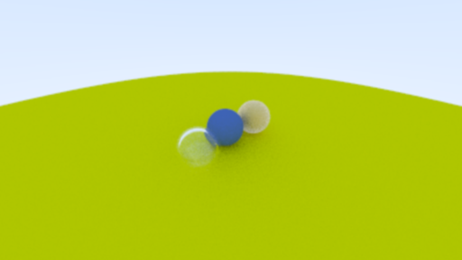 | 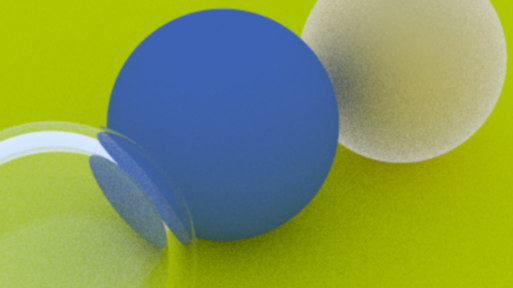 |
| **11장** 속이 빈 유리 구 (전반사, 슐릭 근사) | **12장** 카메라 이동, vfov 90 | **12장** vfov 20 (확대) |
|  |  | |
| **13장** 초점 흐림 | **14장** 최종 장면 | |

---

## 구현 내용

| 장 | 핵심 |
|---|---|
| 2 | PPM(P3) 형식으로 이미지 출력 |
| 3 | Vec3 클래스 (Dot, Cross, UnitVector) |
| 4 | Ray 클래스, 뷰포트, 픽셀 중심으로 광선 발사 |
| 5 | 판별식으로 광선–구 교차 판정 |
| 6 | 법선, Hittable / HittableList 추상화, 앞면·뒷면 판정, Interval |
| 7 | Camera 클래스로 렌더링 코드 분리 |
| 8 | 픽셀당 여러 샘플을 평균 내는 안티에일리어싱 |
| 9 | Lambertian 확산 반사, 재귀 깊이 제한, shadow acne 처리, 감마 2 보정 |
| 10 | Material 추상 클래스, 금속 반사, fuzz |
| 11 | 스넬의 법칙 굴절, 전반사, 슐릭 근사, 속이 빈 유리 구 |
| 12 | lookfrom · lookat · vup, 수직 시야각(vfov) |
| 13 | 렌즈 원판 샘플링으로 초점 흐림 구현 |
| 14 | 무작위 구 약 480개로 구성한 최종 장면 |

## 파일 구조

```
RayTracing.cpp    main: 장면 구성, 카메라 설정, 렌더링 시작
rtweekend.h       공통 상수(Infinity, Pi), 난수 함수, 공통 헤더 모음
vec3.h            Vec3 / Point3, 벡터 연산, 반사·굴절 함수
color.h           Color, 감마 보정, PPM 픽셀 출력
ray.h             Ray (원점 + t × 방향)
interval.h        Interval (t 범위 검사, 색상 Clamp)
hittable.h        HitRecord, Hittable 추상 클래스
hittable_list.h   HittableList (가장 가까운 충돌 찾기)
sphere.h          Sphere (광선–구 교차)
Material.h        Material, Lambertian, Metal, Dielectric
camera.h          Camera (광선 생성, 샘플링, RayColor)
```

## 빌드와 실행

Visual Studio에서 RayTracing.cpp를 빌드한 뒤, 표준 출력을 파일로 리다이렉션하면 이미지가 만들어집니다.

```
RayTracing.exe > image.ppm
```

진행 상황(남은 줄 수)은 표준 에러로 출력됩니다.


## 참고

- 참고 자료: https://github.com/eazuooz/RayTracinginOneWeekendinCUDA
- Ray Tracing in One Weekend (v4.0.x): https://raytracing.github.io
- 공식 코드: https://github.com/RayTracing/raytracing.github.io
